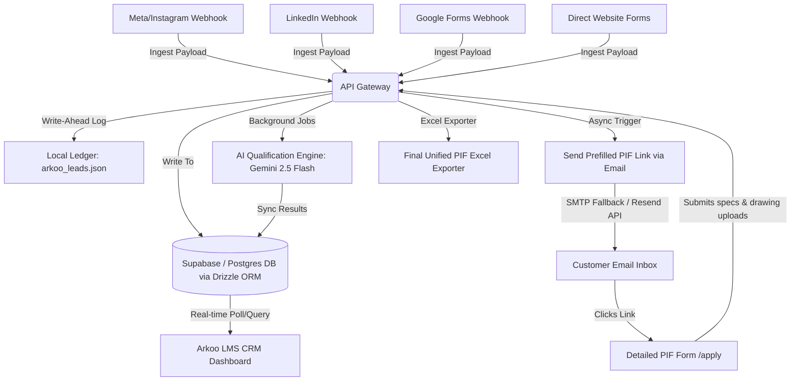

# Project Documentation: Arkoo Prebuild LMS & CRM
**Enterprise Lead Ingestion, AI-Powered Lead Qualification & PIF Spreadsheet Export System**

---

## 1. Executive Summary

**Arkoo Prebuild** is a specialized, end-to-end Lead Management System (LMS) and Customer Relationship Management (CRM) platform custom-built for **Arkoo Pre-Build Pvt. Ltd.** (based in Pune, India). The system automates lead ingestion from diverse channels (social media ads, website forms, Google Sheets), conducts real-time contact validation, qualifies leads using Google Gemini AI models, handles architectural drawing files, and compiles a unified Excel Project Information Form (PIF).

By uniting automated pipelines, validation gates, and generative AI models in a unified portal, Arkoo Prebuild drastically reduces the PEB (Pre-Engineered Building) sales cycle and engineering verification process from days to minutes.

---

## 2. Problem Statement

In the Pre-Engineered Building (PEB) and industrial construction sector, the sales and engineering pipeline suffers from severe inefficiencies:
1. **Disparate Ingestion Channels:** Leads arrive from Meta Ads (Facebook/Instagram), LinkedIn Lead Gen Forms, direct website enquiries, Google Forms, and physical trade shows. Consolidating these manually is slow and prone to human omission.
2. **Vague Initial Data & Ingestion Lag:** Customers often submit vague requests (e.g., "Need a shed"). Sales reps spend hours calling or emailing clients to extract basic parameters (length, width, clear height, site location, timeline, and budget).
3. **Contact Authenticity Issues:** Sales agents waste time following up on fake numbers, wrong emails, or unresolvable corporate mail servers.
4. **Drawing & Spec Sheet Organization:** Tracking architectural blueprint files, client notes, and structural specifications across emails and messages is unorganized and hard to audit.
5. **Excel PIF Preparation Latency:** Translating manual requirements and drawing parameters into a structured Excel Project Information Form (PIF) to initiate structural drawing layouts in CAD/BIM is time-consuming.
6. **Data Loss Risks:** Cloud database connections (like PostgreSQL) can experience intermittent network drops. Without a local fail-safe, incoming webhooks during database outages lead to catastrophic loss of business leads.

---

## 3. Gap Analysis

| Feature Area | Legacy / Traditional CRM System | Arkoo Prebuild CRM (The "After" State) | Business Value & Impact |
| :--- | :--- | :--- | :--- |
| **Lead Ingest** | Manual spreadsheet downloads from Ads Managers; copying website forms. | Real-time automated ingestion webhooks (Meta, LinkedIn, Google Forms) and direct endpoints. | Eliminates human delay; leads are contacted within minutes of submission. |
| **Data Integrity** | Leads lost if cloud databases go offline or have connection issues. | **Local Ledger System (`arkoo_leads.json`):** Immediate local JSON persistence acting as a Write-Ahead Log (WAL) before DB sync. | 100% lead durability; zero business opportunities lost due to server/database disconnects. |
| **Lead Verification** | Reps manually call/email contacts only to find invalid phone numbers or bad emails. | Automated DNS MX domain checks to verify mail server existence, combined with **Firebase Phone OTP (Invisible ReCAPTCHA)** and email OTPs. | High-fidelity contact lists; sales team focus is restricted to validated, reachable prospects. |
| **Profiling & PIF** | Reps run phone interviews to collect building length, width, height, budget, and timeline. | Auto-sends emails containing prefilled, customized **Project Information Form (PIF)** links immediately upon ingestion. | Minimizes friction; client inputs detailed specifications directly into a structured portal. |
| **Lead Qualification** | Subjective, manual screening of leads by staff, leading to misprioritized tasks. | **AI Qualification Engine (Gemini 2.5 Flash):** Evaluates geography, area, budget, timeline, land ownership, and approvals to rank leads (HOT, WARM, COLD). | Maximizes efficiency; hot leads are immediately identified and pushed to the top of the queue. |
| **BOM & Specifications Export** | Engineers prepare PIF spreadsheets manually. | **Excel Exporter (`exceljs`):** Compiles building parameters, structural details, and crane specs into a formatted `Final_Unified_PIF.xlsx` sheet. | Accelerates drawing requests; outputs ready-to-use structural templates for drafting divisions in one click. |

---

## 4. System Architecture & Data Flow

Arkoo Prebuild uses a monorepo structure designed for horizontal scalability, separating backend services, reusable libraries, and frontend applications.

---

## 5. Platform Components & User Interfaces

### A. The Landing Page & Lead Capture Interface
*Deployed at:* [arkoo-u8sx.onrender.com/landing/](https://arkoo-u8sx.onrender.com/landing/)
* **Futuristic Cyber-Industrial Theme:** Features ambient orange-blue gradient glows, structural grid overlays, and interactive SVG network coordinates, embodying Arkoo's engineering focus.
* **Dual OTP Verification:** Uses a custom Firebase Auth client (Invisible ReCAPTCHA) to trigger Phone SMS verification and a server-side OTP system to verify corporate emails.
* **Smart Progress Indicators:** A completion meter dynamically updates as the user fills out required fields, boosting conversion rates.

### B. The Detailed Project Specification Form (PIF / `/apply` Page)
* **Pre-filled Context:** Ingests URL query params (name, email, phone, location, area, budget) to populate inputs automatically, saving customer effort.
* **Drawing Upload Gateway:** Supports multi-file uploads (Architectural drawings, Tender drawings, Supporting files) via a unified Multer memory buffer stream.
* **Business Feasibility Inputs:** Collects parameters like land ownership status (owned vs. rented), government approval status, and architect availability (including architect contact details).

### C. The LMS CRM Command Center
*Deployed at:* [gleeful-palmier-7980a0.netlify.app/dashboard](https://gleeful-palmier-7980a0.netlify.app/dashboard)
* **Real-time Pipeline Command:** Integrates an advanced search bar and filters to query leads by pipeline status, ingestion channel, or AI category (HOT/WARM/COLD).
* **Aggregated Stats widgets:** Displays Total Leads, Hot Leads, Warm Leads, Cold Leads, and Average Lead Scoring, refreshing automatically.
* **Data Portability:** Features an export handler to generate comprehensive CSV reports of the active filtered pipeline, including aggregate columns like total counts and average AI scoring.
* **Details Workspace:** Inside the detailed view, agents can manage pipeline status (e.g. `New`, `Form Pending`, `Form Filled`, `Contacted`), input notes, review extracted parameters, and download customer documents.

---

## 6. Technology & Tooling Matrix

The project employs a premium stack to maintain speed, scalability, type safety, and AI reasoning capabilities.

| Tool / Platform | Technology | Why it was selected |
| :--- | :--- | :--- |
| **Core Runtime** | Node.js (v18+) & pnpm Workspaces | Fast monorepo package resolution, isolated packages, and shared libraries (`lib/db`, `lib/api-zod`). |
| **Backend Framework** | Express.js 5 | Extremely lightweight, supports async handler error propagation natively, and processes incoming webhooks efficiently. |
| **Database ORM** | Drizzle ORM | High-speed, type-safe SQL queries, zero abstraction overhead, and works out-of-the-box with PostgreSQL. |
| **Database Server** | Supabase (PostgreSQL) | Managed hosting, built-in connection pooling, and real-time database listener capabilities. |
| **AI Models** | Google Gemini SDK (`gemini-2.5-flash`) | Fast, low-latency, and highly cost-effective model used for rapid automated lead scoring and categorization. |
| **Frontend Framework** | React 19, TypeScript, & Vite 7 | Provides modern reactive components, rapid HMR (Hot Module Replacement), and compiler-backed performance optimizations. |
| **UI Design System** | TailwindCSS 4 & Radix UI | Enables highly customized styling, dark-mode styling, and accessible UI component states. |
| **Routing** | Wouter | A tiny, zero-dependency alternative to React Router, perfect for lightweight, high-performance SPAs. |
| **Email Delivery** | Resend API & Nodemailer (SMTP) | Dual-path ensures local development runs on free SMTP (Gmail), while production deployments bypass port limits using Resend's HTTPS API. |
| **Data Parsing** | `pdf-parse`, `xlsx`, `adm-zip`, `@xmldom/xmldom` | Native JavaScript parsers used to strip text buffers from PDF blueprints, Excel schedules, and DOCX documents before AI digestion. |
| **Excel Generation** | `exceljs` | Professional, server-side styling and creation of spreadsheet files to produce formatted `.xlsx` project specification grids. |

---

## 7. Features & Integrations (Detailed Deep Dive)

### 1. Lead Verification Gateways
* **DNS MX Resolution:** Resolves target email domains (`dns.resolveMx`) to verify if the domain holds active mail exchanges, returning detailed errors (e.g., "Domain does not exist or has no mail servers").
* **Double OTP Verification:** Sends verified verification tokens with 10-minute expiry (TTL) and a 60-second resend guard. Prevents brute-forcing by locking verification after 3 consecutive wrong entries.

### 2. Multi-Channel Webhook Ingestion
Normalizes payloads from diverse platforms into a unified interface:
* **LinkedIn Webhook:** Uses OAuth 2.0 authorization flows. Verifies incoming signatures using SHA256 HMAC keys in headers (`x-li-signature`) to block spoofed payloads.
* **Meta/Instagram Webhook:** Implements page subscription listeners, returning Facebook validation challenge codes while queuing lead extraction via Graph API tokens.
* **Google Forms Webhook:** Custom HTTP POST parser mapping arbitrary spreadsheet fields (e.g., matching inputs like `fullname`, `customername`, `sitelocation`).

### 3. AI Lead Qualification Engine
Leveraging `gemini-2.5-flash`, the system applies weighted point scoring constraints:
* **Geography Proximity (+20 pts):** Prefers core locations (e.g., Pune, Mumbai, Delhi).
* **High-Value Project Type (+15 pts):** Prefers industrial structures (Warehouse, Multistory, Industrial Shed).
* **Area Scaling (+15 pts):** Scales points based on size (Hot: >7,000 sq ft, Warm: 5,000-7,000 sq ft, Cold: <3,000 sq ft).
* **Commercial Readiness:** Awards points for owned land (+10), government approvals (+10), and pre-hired architect details (+10).
* **Categorization Output:** Sums points to return HOT (70+), WARM (40-69), or COLD (<40) labels with clear AI reasoning.

### 4. Unified PIF Excel Spreadsheet Exporter (`/api/pif/generate`)
* Combines parameters and manual customer details to export a fully formatted Excel document (`Final_Unified_PIF.xlsx`). It generates customized color-coded sections (soft ice blue, soft teal, light gray) detailing Project Meta headers, Building Parameters, Secondary Framing, Crane Specifications, Mezzanine Layouts, and Committed Delivery Schedules.

---

## 8. Detailed Tools Reference: Where & How They Work

Here is the exact breakdown of the primary tools and libraries configured across the Arkoo Prebuild codebase:

### A. AI Core: Google Gemini SDK (`@google/genai`)
*   **Where it is used:** Configure and executed inside `artifacts/api-server/src/services/ai-qualification.ts` and `artifacts/api-server/src/routes/analyze-drawing.ts`.
*   **How it works:**
    *   In the **AI Qualification Engine**, the backend collects the user's PIF variables (area, location, timeline, land status) and generates a structured prompt describing Arkoo's point-based criteria. It queries `gemini-2.5-flash` with `responseMimeType: "application/json"`. The model evaluates the points and returns a categorized JSON string containing the final `score` and `category` (HOT, WARM, COLD).
    *   In the **Drawing Analyzer**, it uploads multi-format drawings (PDFs, images) directly using the **Gemini Files API** (`ai.files.upload`). Once the status switches from `PROCESSING` to `ACTIVE`, the model queries the blueprint coordinates to extract length, width, eave clear heights, bay layouts, cranes capacity, and wind speed parameters.
*   **Why it was selected:** Offers high-speed JSON schemas, visual capabilities for analyzing construction blueprints, and low-latency response times.

### B. Excel Core: ExcelJS (`exceljs`)
*   **Where it is used:** Formatted in `artifacts/api-server/src/routes/pif.ts` at the `/pif/generate` endpoint.
*   **How it works:** ExcelJS initiates a server-side workbook (`ExcelJS.Workbook()`) and creates a sheet structure. It configures column widths, merges cells for headers (e.g. `A1:C1`), and inserts cell borders and text styles (using 'Times New Roman'). Fills background grids with hex fills (e.g., Ice Blue: `FFB8CCE3`, Soft Teal: `FFB7DEE8`) to partition building parameters, secondary framing, crane details, and mezzanine layouts before streaming raw byte buffers back for client download.
*   **Why it was selected:** Allows precise, programmatic grid design, background coloring, and border formatting to match Arkoo's official engineering design sheets.

### C. Authentication Core: Firebase Client & Admin SDKs
*   **Where it is used:** Frontend landing form (`landing_page/app.js` and `landing_page/index.html`) and backend API verification.
*   **How it works:** The landing page calls `/api/otp/config` to retrieve public client configurations. It initializes the Firebase library and binds an invisible ReCAPTCHA target (`firebase.auth.RecaptchaVerifier`) to the submission buttons. When the client requests an OTP, Firebase triggers a verification SMS to their mobile device. The client inputs the verification code, and Firebase confirms authentication.
*   **Why it was selected:** Provides a robust, bot-free telephone authentication gateway, preventing fake registrations.

### D. Dual-Path Mailer: Nodemailer & Resend HTTP API
*   **Where it is used:** Configured in `artifacts/api-server/src/routes/arkoo-lead.ts` and `artifacts/api-server/src/routes/otp.ts`.
*   **How it works:** Implements a dual-route mailer. If `RESEND_API_KEY` is set in the environment variables, the system executes an asynchronous HTTP POST request to Resend's secure API at `https://api.resend.com/emails`. If the API key is not present (or fails), it instantiates a standard SMTP transporter via Nodemailer, connecting to `smtp.gmail.com` on port 587 using secure SMTP credentials to send validation and status emails.
*   **Why it was selected:** Free cloud hosting platforms like Render block standard SMTP ports to prevent spam. Sending emails via Resend's HTTP API over port 443 bypasses these blocks, while standard SMTP remains active as a backup for local development.

### E. Database Layer: Drizzle ORM & PostgreSQL
*   **Where it is used:** Found under `lib/db` schema definitions and called across all REST endpoints in `artifacts/api-server/src/routes`.
*   **How it works:** Drizzle ORM acts as the direct SQL connection wrapper mapping PostgreSQL schemas. Tables are configured via Postgres Core primitives (`pgTable`, `serial`, `varchar`, `jsonb`, `uuid`). Routes execute SQL queries using declarative syntax (e.g., `db.select().from(leadsTable).leftJoin(...)`), which are compiled into highly optimized SQL statement strings at runtime.
*   **Why it was selected:** Delivers type safety, automated database migration tracking, and removes abstraction latency compared to heavier ORMs like Prisma.

### F. Node.js Native DNS Module (`dns`)
*   **Where it is used:** Configured in the email validation controller at `artifacts/api-server/src/routes/email-validation.ts`.
*   **How it works:** Extracts the domain name from the submitted email string and executes `promisify(dns.resolveMx)`. This makes an asynchronous network call to local DNS servers to retrieve the domain's Mail Exchanger records. If the domain is unregistered or lacks MX servers, the validation fails.
*   **Why it was selected:** Identifies invalid or fake domains instantly before triggering the SMS/Email OTP code pipelines.

### G. Document Strippers: `pdf-parse`, `xlsx`, `adm-zip`, and `@xmldom/xmldom`
*   **Where it is used:** Integrated in `artifacts/api-server/src/services/ai-extraction.ts`.
*   **How it works:**
    *   `pdf-parse`: Decodes binary PDF buffers to extract plain-text strings.
    *   `adm-zip` & `@xmldom/xmldom`: Unzips Word `.docx` documents to extract the underlying XML tree (`word/document.xml`), parsing paragraphs and returning text node values.
    *   `xlsx`: Reads binary Excel spreadsheets, extracts sheets, and outputs rows as plain text.
*   **Why it was selected:** Converts binary documents into plain text strings so they can be parsed by the Gemini API without exceeding token limits.

### H. Middleware Parser: Multer
*   **Where it is used:** Configured in backend routes `pif.ts` and `arkoo-lead.ts`.
*   **How it works:** Multer acts as Express routing middleware to parse incoming `multipart/form-data` uploads. It intercepts binary file arrays (such as architectural layout drawings), processes them in RAM using memory storage (`multer.memoryStorage()`), and exposes them directly in the request object as file buffers (`req.files`).
*   **Why it was selected:** Bypasses local disk storage writes, speeding up file processing.

### I. Frontend Router: Wouter
*   **Where it is used:** Configured in frontend entry point `artifacts/arkoo-crm-frontend/src/App.tsx`.
*   **How it works:** Listens to navigation events in the browser and updates the URL pathname. It wraps pages in dynamic conditional path expressions (`<Route path="/leads/:id" component={LeadDetail} />`) and loads the target components dynamically without full-page reloads.
*   **Why it was selected:** A ultra-lightweight alternative to React Router, minimizing the frontend bundle size.

---

## 9. Database Schema Design

The database schema is mapped in Drizzle ORM to PostgreSQL:

### A. Users Table (`users`)
Stores platform accounts, permissions, and roles:
* `id` (UUID, Primary Key)
* `email` (Varchar, Unique)
* `role` (Varchar, Default: `admin`)
* `status` (Varchar, Default: `active`)
* `createdAt` / `updatedAt` (Timestamp)

### B. Leads Table (`leads`)
Captures initial channel ingestion data:
* `id` (Serial, Primary Key)
* `source` (Varchar - e.g., "Website", "LinkedIn", "Instagram")
* `rawData` (JSONB - Stores original webhook payloads, uploaded drawing paths, and notes)
* `aiScore` (Integer, Default: 0)
* `aiCategory` (Varchar - HOT, WARM, COLD)
* `status` (Varchar - e.g., "Form Pending", "Form Filled", "Contacted")
* `assignedToUserId` (UUID, Foreign Key referencing `users.id`)

### C. Customers Table (`customers`)
Holds verified customer contact details:
* `id` (Serial, Primary Key)
* `leadId` (Integer, Foreign Key referencing `leads.id`)
* `name` (Varchar)
* `contactInfo` (Text - Stores phone & email JSON)
* `address` (Text - Stores location)

### D. Projects Table (`projects`)
Maps technical and commercial building details:
* `id` (Serial, Primary Key)
* `customerId` (Integer, Foreign Key referencing `customers.id`)
* `type` (Varchar - e.g., "PEB Warehouse", "Commercial Space")
* `areaSqft` (Integer)
* `budget` (Numeric)
* `timeline` (Varchar)

---

## 10. Security, Durability & Fallbacks

* **Write-Ahead Ingest (WAL):** The backend saves lead data to `arkoo_leads.json` immediately upon webhook trigger. If PostgreSQL fails due to connection pool limits, the webhook still returns a success status to Meta/LinkedIn. Once DB connectivity returns, the logs can be re-synced.
* **Dual-Path Email Fallback:** In server environments like Render, outgoing SMTP ports (25, 465, 587) are often blocked to prevent spam. The backend resolves this by sending email through HTTPS via Resend's API. If Resend is unavailable or fails, it switches back to Gmail SMTP, ensuring local servers and staging servers continue working.
* **AI Fallbacks:** If the Gemini API hits rate limits or fails, the backend runs a fallback rule engine. It reviews raw text inputs using regex patterns to calculate lead scores (e.g. looking for keywords like "Pune", "Urgent", or high budgets), keeping the lead pipeline moving.
